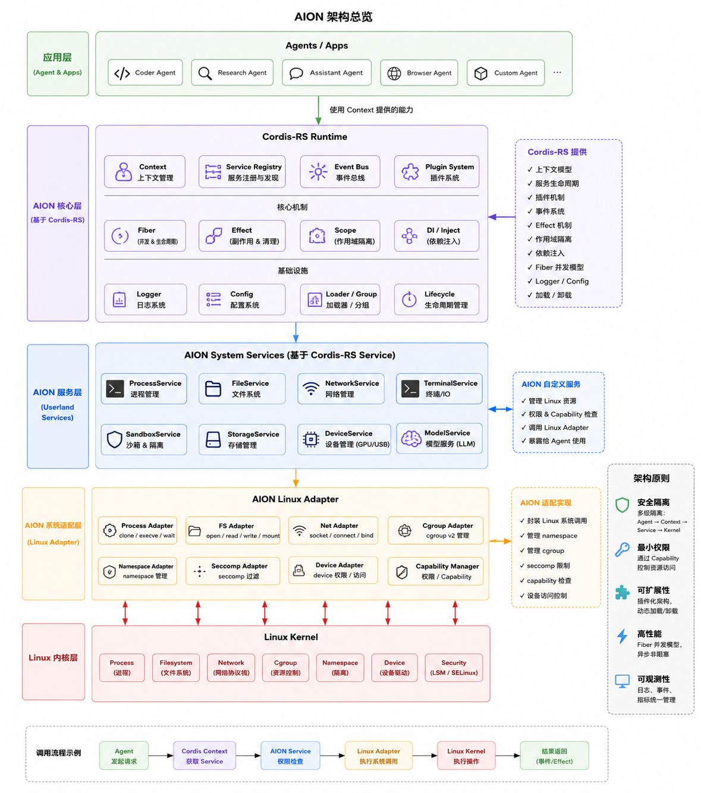

<div align="center">


# AION

**Agent Operating Infrastructure & Nations · Agent OS Runtime**

基于 Linux 的 Agent「操作系统」运行时：Cordis-RS 核心 · 系统服务 · Linux 适配层

[](https://github.com/JayCRL/AION/actions/workflows/ci.yml)
[](LICENSE)
[](https://www.rust-lang.org)

</div>

---

AION 把 Agent 运行所需的「上下文、并发、隔离、权限、资源、模型」组织成一个类似操作系统的分层运行时：

- **应用层（Agents & Apps）**：Coder / Research / Assistant / Browser / Custom Agent，全部通过 Context 使用系统能力；
- **核心层（Cordis-RS Runtime）**：Context、Service Registry、Event Bus、Plugin System + Fiber、Effect、Scope、DI + Logger、Config、Loader、Lifecycle；
- **服务层（AION System Services）**：进程、文件、网络、终端、沙箱、存储、设备、模型八类服务，负责权限检查；
- **适配层（AION Linux Adapter）**：封装 namespace / cgroup v2 / seccomp / capability / mount 等 Linux 系统调用；
- **内核层（Linux Kernel）**：进程、文件系统、网络、资源控制、隔离、设备、安全（LSM/SELinux）。

## 架构总览



## 调用流程

```
Agent 发起请求 → Cordis Context 获取 Service → AION Service 权限检查
              → Linux Adapter 执行系统调用 → Linux Kernel 执行操作
              → 资源返回（事件 / Effect）
```

一次 `aion demo` 会逐步打印上述六个阶段（包括权限拒绝的负例），并演示事件流与 Effect 清理。

## 快速开始

```bash
# 构建并运行完整演示（Linux 下为真实沙箱；Windows/macOS 下为宿主模拟）
cargo run -p aion -- demo

# 交互式终端
cargo run -p aion -- repl

# 执行一次 Agent 任务
cargo run -p aion -- run --agent assistant --kind chat --input "介绍一下 AION"
cargo run -p aion -- run --agent coder --kind run --input "echo hello"

# 列出运行时加载的系统服务
cargo run -p aion -- services
```

可选配置文件 `aion.json`（放在工作目录，不存在则使用默认值）：

```json
{
  "log.level": "info",
  "storage.root": "var/storage",
  "model.default_backend": "echo"
}
```

## 工程结构

```
crates/
├── cordis/          # AION 核心层 — Cordis-RS Runtime
│   ├── context      # 上下文管理（一切 API 的入口）
│   ├── service      # 服务注册与发现（provide / require / 依赖注入）
│   ├── event        # 事件总线（on / once / emit + 监视通道）
│   ├── plugin       # 插件系统（独立子作用域加载）
│   ├── fiber        # Fiber 并发模型（随作用域取消）
│   ├── effect       # Effect 副作用清理（销毁时逆序执行）
│   ├── scope        # 作用域隔离（级联销毁）
│   ├── logger       # 日志系统（分级 + 环形缓冲）
│   ├── config       # 配置系统（点路径 / 深合并）
│   ├── loader       # 加载器 / 分组（App 构建器）
│   └── lifecycle    # 生命周期状态机
├── aion-adapter/    # AION 系统适配层 — Linux Adapter
│   ├── process      # clone / execve / wait（pre_exec 应用沙箱）
│   ├── fs           # open / read / write / mount
│   ├── net          # socket / connect / bind
│   ├── cgroup       # cgroup v2 管理（memory / cpu / pids）
│   ├── namespace    # unshare / setns（mnt pid net ipc uts）
│   ├── seccomp      # seccomp-BPF 白名单过滤
│   ├── device       # 设备权限 / 访问（/dev 枚举）
│   └── capability   # 权限 / Capability（PR_CAPBSET_DROP）
├── aion-services/   # AION 服务层 — System Services（基于 Cordis-RS Service）
│   ├── process      # 进程管理        ├── sandbox   # 沙箱 & 隔离
│   ├── fs           # 文件系统        ├── storage   # 存储管理（配额）
│   ├── network      # 网络管理        ├── device    # 设备管理
│   ├── terminal     # 终端 / IO       └── model     # 模型服务（LLM）
│   └── security     # 权限 & Capability 检查模型
└── aion/            # 应用层 — Agents / Apps & CLI
    ├── agents/      # Coder / Research / Assistant / Browser / Custom
    ├── demo.rs      # 调用流程示例
    ├── repl.rs      # 交互式终端
    └── boot.rs      # 运行时启动器
```

## 架构原则

| 原则 | 说明 | 代码落点 |
|------|------|----------|
| 安全隔离 | 多级隔离 Agent → Context → Service → Kernel | `cordis::scope`、`aion-adapter::namespace`、`SandboxProfile` |
| 最小权限 | 通过 Capability 控制资源访问 | `aion-services::security`、`aion-adapter::capability` |
| 可扩展性 | 插件化架构，动态加载 / 卸载 | `cordis::plugin`、`cordis::loader` |
| 高性能 | Fiber 并发模型，异步非阻塞 | `cordis::fiber`（tokio 任务托管） |
| 可观测性 | 日志、事件、指标统一管理 | `cordis::logger`、`cordis::event`（监视通道）、cgroup stats |

## 平台支持

| 能力 | Linux (root) | Linux (非 root) | Windows / macOS |
|------|:-----:|:-----:|:---------------:|
| 编译 & 测试（CI） | ✅ | ✅ | ✅ |
| 进程 / 文件 / 网络 / 终端 | ✅ | ✅ | ✅ |
| namespace 隔离 | ✅ | ➖ 自动跳过 | ❌（内存模拟或返回 Unsupported） |
| seccomp / capability 收缩 | ✅ | ➖ 自动跳过 | ❌ |
| cgroup v2 资源限制 | ✅ | 尽力而为（失败发警告事件） | ❌（内存模拟） |
| 进程沙箱强制执行 | ✅ `sandboxed=true` | ⚠️ 仅 `no_new_privs` | ❌（`sandboxed=false`） |

> 非 Linux 平台上运行时不会失败：cgroup 走 `EmulatedCgroupAdapter`，namespace/seccomp 报告不支持，
> 沙箱是否真实执行通过 `sandboxed` 标记暴露给服务层与演示输出。

## 开发

```bash
cargo test --workspace     # 全部测试
cargo build --workspace    # 构建
```

提交 PR 前建议本地跑通 CI 同款命令（见 `.github/workflows/ci.yml`，ubuntu + windows 双平台构建与测试）。

## License

[MIT](LICENSE) © JayCRL
